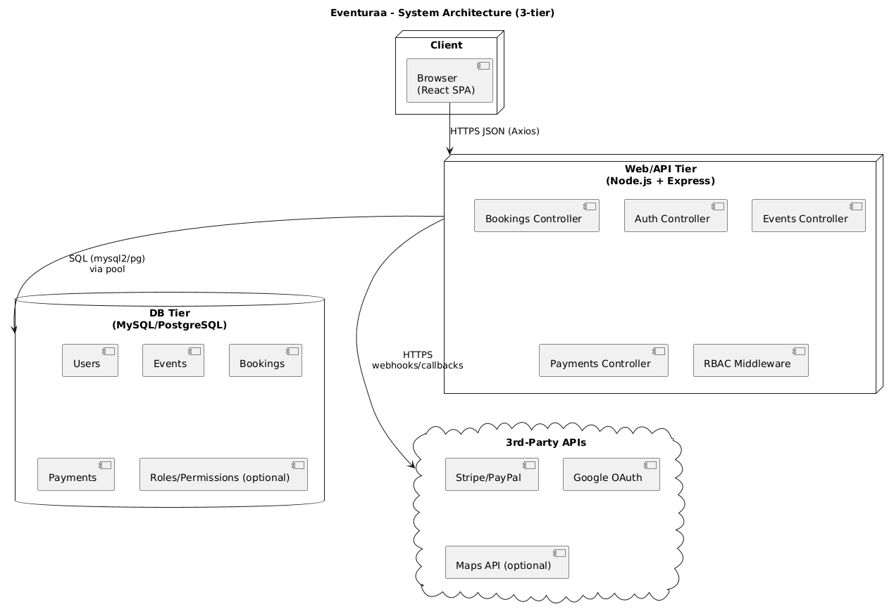

# System Design – Eventuraa (Event Management System)

**Team:** Shashi Preetham Goud Palle • Lakshmi Pravallika Chavvakula • Phanindra Nagu  
**Due:** Oct 18, 2025 • **Style:** 3-Tier (React SPA ↔ Node/Express API ↔ MySQL/PostgreSQL)

---

## 1) System Architecture Overview (Student 1)

**Architecture Style:** 3-Tier (Client / API / DB)

- **Front-end (React SPA):** UI, routing, forms, Axios for API calls, token storage (access token).
- **Back-end (Node.js + Express):** REST API, auth, RBAC middleware, validation, business logic.
- **Database (MySQL/PostgreSQL):** Users, Events, Bookings, Payments (from Part 2).
- **3rd-Party APIs:** Stripe/PayPal (payments), Google OAuth (social login), Maps (optional).
- **Data Flow:** React → Axios → Express routes → Services → DB → JSON response → React.

**Diagram:**

---

## 2) Technology Stack (Student 1)

- **Front-end:** React 18, React Router, Axios; (optional) Redux Toolkit for global state.
- **Back-end:** Node 20, Express 4, bcrypt, jsonwebtoken, express-validator, cors, helmet, morgan.
- **Database:** MySQL 8 (mysql2) *or* PostgreSQL 15 (pg).
- **Authentication:** JWT access tokens (1h), optional refresh tokens (httpOnly cookie), optional Google OAuth via Passport.js.
- **Testing:** Jest, Supertest (API), React Testing Library.
- **DevOps/Deploy:** Docker (multi-stage), AWS (EC2/RDS) or Render/Vercel/Netlify.
- **Observability:** morgan (HTTP logs), winston (app logs).

## 3) Authentication & Role-Based Access Control (Student 2)

**Roles:** Guest, Attendee, Organizer, Admin

### 3.1 RBAC Matrix (Key Actions)

| Action                | Guest | Attendee     | Organizer     | Admin     |
|-----------------------|:-----:|:------------:|:-------------:|:---------:|
| Register/Login        | Yes   | Yes          | Yes           | Yes       |
| Browse Events         | Yes   | Yes          | Yes           | Yes       |
| Book Ticket           | No    | Yes          | No            | Yes       |
| Cancel Booking        | No    | Yes (own)    | No            | Yes (any) |
| Create Event          | No    | No           | Yes           | Yes       |
| Edit/Delete Event     | No    | No           | Yes (own)     | Yes (any) |
| View All Users        | No    | No           | No            | Yes       |
| Approve Events        | No    | No           | No            | Yes       |

### 3.2 Authentication Flow

1. **Registration/Login:** Client (React) → `POST /api/users/register` or `POST /api/users/login`
2. **Tokens:** JWT access token (~1 hour) stored in browser memory or `localStorage`.
3. **Middleware:** 
   - `authMiddleware` verifies JWT on protected routes
   - `requireRole('organizer' | 'admin')` for role-restricted endpoints
4. **Logout:** Client deletes token
5. **Password Hashing:** `bcrypt` with ≥ 12 salt rounds

### 3.3 Security Notes

- No plain-text passwords; always hash with `bcrypt`
- HTTPS in production
- Rotate tokens periodically
- Keep secrets in `.env`
- Validate inputs using `express-validator`

### 3.4 Reference Diagram

Use Case Diagram:  
`docs/use-case-system.png`

